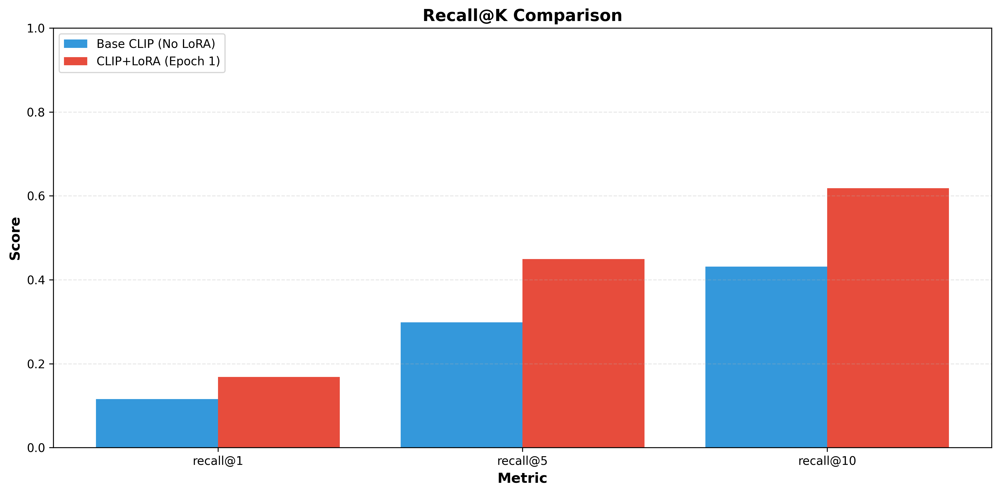
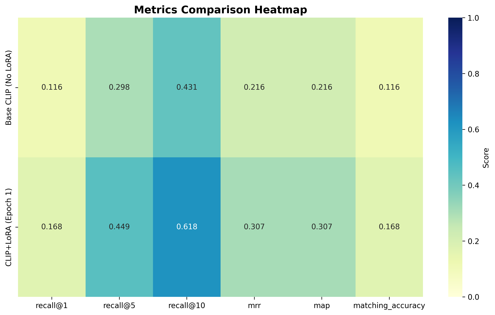
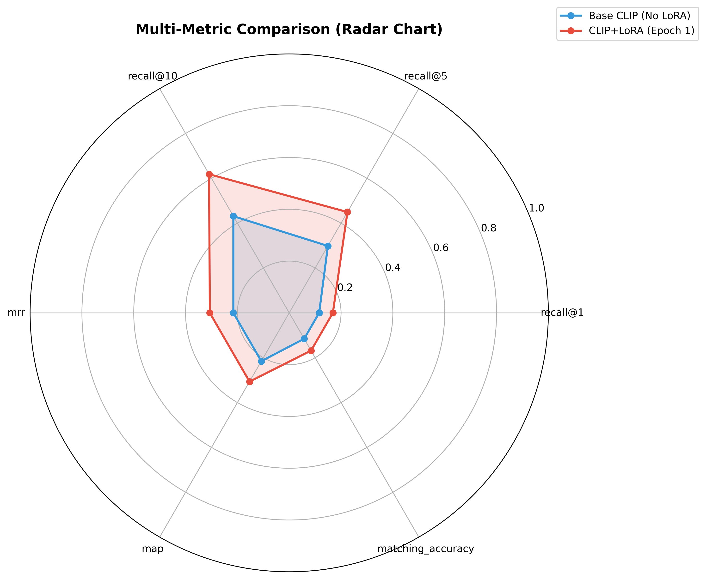

# Model Evaluation Report

**Generated:** 2025-12-06 00:10:48

---

## 1. Model Comparison

| Model | Recall@1 | Recall@5 | Recall@10 | MRR | mAP | Matching Acc |
|-------|----------|----------|-----------|-----|-----|-------------|
| Base CLIP (No LoRA) | 0.1155 | 0.2984 | 0.4312 | 0.2156 | 0.2156 | 0.1155 |
| CLIP+LoRA (Epoch 1) | 0.1684 | 0.4494 | 0.6183 | 0.3065 | 0.3065 | 0.1684 |

---

## 2. Best Models

- **recall@1**: CLIP+LoRA (Epoch 1) (0.1684)
- **recall@5**: CLIP+LoRA (Epoch 1) (0.4494)
- **recall@10**: CLIP+LoRA (Epoch 1) (0.6183)
- **mrr**: CLIP+LoRA (Epoch 1) (0.3065)
- **map**: CLIP+LoRA (Epoch 1) (0.3065)
- **matching_accuracy**: CLIP+LoRA (Epoch 1) (0.1684)

---

## 3. Visualizations

### Recall Comparison

### Metrics Heatmap

### Radar Comparison

---

## 4. Performance Analysis

